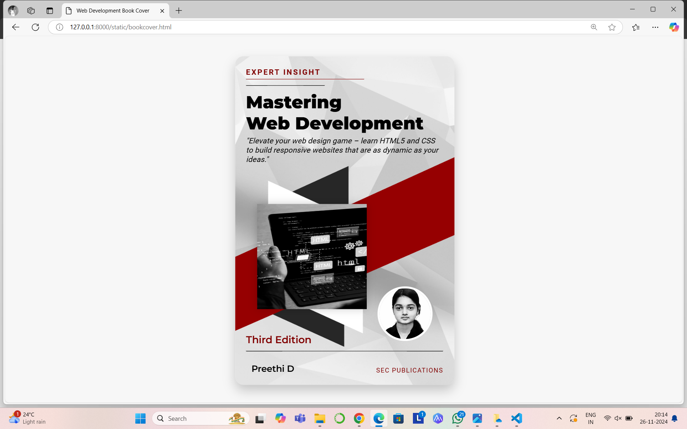

# Ex.06 Book Front Cover Page Design
## Date:26-11-2024

## AIM:
To design a book front cover page using HTML and CSS.

## DESIGN STEPS:

### Step 1:
Create a Django Admin project.

### Step 2:
Create an app in the Django interface.

### Step 3:
Create a folder named 'static' in the app folder.

### Step 4:
Create a new HTML file in the static folder.

### Step 5:
Write the HTML code with relevant CSS properties.

### Step 6:
Choose the appropriate style and color scheme.

### Step 7:
Insert the images in their appropriate places.

### Step 8:
Publish the website in the LocalHost.

## PROGRAM:
html
```
<html>
<head>
    <title>Web Development Book Cover</title>
    <link rel="stylesheet" href="bookcover.css">
    <link href="https://fonts.googleapis.com/css2?family=Roboto:wght@400;700&family=Montserrat:wght@600;900&display=swap" rel="stylesheet">
</head>
<body>
    <div class="book-cover">
        <div class="expert-insight">EXPERT INSIGHT
        <hr id="first"> 
    <hr id="second"> </div>
        <div class="book-content">
            <h1 class="book-title">Mastering<br>Web Development</h1>
            <p class="book-subtitle">"Elevate your web design game – learn HTML5 and CSS to build responsive websites that are as dynamic as your ideas."</p>
        </div>
        <div class="diamond">
            
       </div>
        <div class="edition">Third Edition</div>
        <hr>
        <div class="author-info">
            <div class="author-photo">
                
            </div>
            <p class="author-name">Preethi D</p>
        </div>
        <div class="publisher-logo">Saveetha Publishers</div>
    </div>
</body>
</html>
```

css
```
* {
    margin: 0;
    padding: 0;
    box-sizing: border-box;
}

body, html {
    height: 100%;
    font-family: 'Roboto', sans-serif;
    background-color: #f7f7f7;
    display: flex;
    justify-content: center;
    align-items: center;
}

.book-cover {
    width: 400px;
    height: 600px;
    position: relative;
    background: url('redblack.jpg') no-repeat center center;
    background-size: cover;
    border-radius: 15px;
    box-shadow: 0 10px 20px rgba(0, 0, 0, 0.2);
    overflow: hidden;
    color: black;
    text-align: left;
    padding: 20px;
}

.expert-insight {
    font-family: 'Roboto', sans-serif;
    font-size: 14px;
    font-weight: bold;
    color: maroon;
    letter-spacing: 2px;
    margin-bottom: 10px;
}

#first {
     border-top: 1px solid maroon;
     margin-top:5px;
     width: 60%;
     left:0px;
}

#second{
    border-top: 1px solid black;
     width: 40%;
     left:0px;
}

.book-title {
    font-family: 'Montserrat', sans-serif;
    font-weight: 900;
    font-size: 32px;
    line-height: 1.2;
    margin-bottom: 5px;
}

.book-subtitle {
    font-family: 'Roboto', sans-serif;
    font-style: italic;
    font-weight: 400;
    font-size: 14px;
    color:black;
    margin-bottom: 310px;
}

.diamond img {
    position: absolute;
    top: 45%;    
    left: 10%; 
    width: 50%;  
    height:32%; 
    box-shadow: 0 0 15px rgba(0, 0, 0, 0.2);  
   
}

.edition {
    font-family: 'Montserrat', sans-serif;
    font-size: 18px;
    font-weight: 600;
    color: maroon;
   
}

hr{
     border-top: 1px solid black;
     margin-top: 10px;
     margin-bottom: 10px;
     width: 100%;
}

.author-photo img {
    position: absolute;
    bottom: 80px;
    display: flex;
    align-items: center;
    width: 100px;
    height: 100px;
    border-radius: 50%;
    right:40px;
    border: 4px solid white;
    object-fit: cover;
}

.author-name {
    position: absolute;
    bottom: 80px;
    display: flex;
    align-items: center;
    font-family: 'Montserrat', sans-serif;
    font-weight: 600;
    font-size: 16px;
    bottom: 20px;
    left: 30px;
}


.publisher-logo {
    position: absolute;
    bottom: 20px;
    right: 20px;
    font-family: 'Roboto', sans-serif;
    font-size: 12px;
    color: maroon;
    letter-spacing: 1px;
}
```

## OUTPUT:


## RESULT:
The program for designing book front cover page using HTML and CSS is completed successfully.
